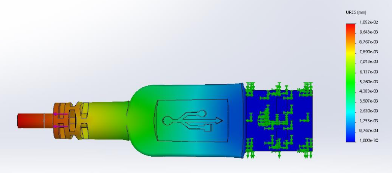

## SolidWorks modeling results for my Mechanical Engineering course  
Did this while studying Electrical Engineering for a year at Warsaw Uni of Technology (2020).  

The assignment was to model any object in SolidWorks and perform two basic simulations: strain and displacement.  
I ended up picking a USB plug because that's what was lying around - not much inspiration when it's a pandemic and you're stuck in a dorm room.

PDF files for this project: [results report](Results_Report.pdf) and a [modeling walk-through document](Process_Report.pdf)

### General view

### Strain simulation

### Displacement simulation

